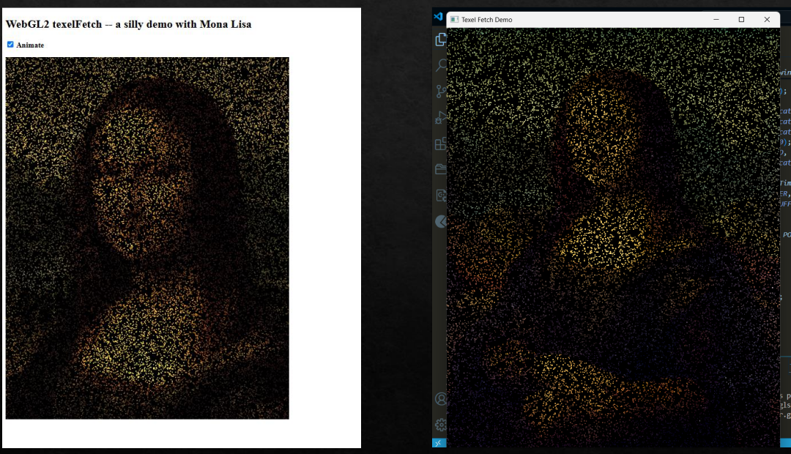
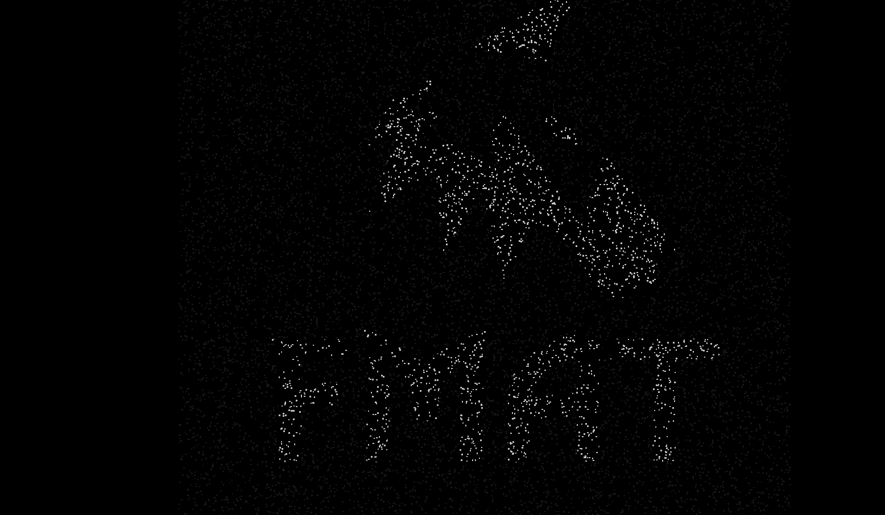

# TexelFetch en OpenGL (imitando WebGL 2.0)

Este repositorio demuestra cómo implementar la funcionalidad `texelFetch` vista en WebGL 2.0, utilizando C++ y OpenGL moderno (GLSL). El objetivo es ilustrar cómo acceder directamente a un texel específico de una textura sin interpolación, basado en el ejemplo interactivo:

🔗 https://math.hws.edu/graphicsbook/source/webgl/texelFetch-MonaLisa-webgl2.html

  

##  Objetivo

Recrear el comportamiento del ejemplo WebGL 2.0 que usa `texelFetch` para leer un píxel (texel) directamente de una textura y mostrarlo en pantalla al pasar el mouse sobre una imagen. En este caso, se realiza en un entorno OpenGL con C++.

##  Ejemplo WebGL original

El ejemplo original de WebGL2 (texelFetch-MonaLisa-webgl2.html) implementa una animación de puntos sobre una imagen estática (la Mona Lisa), utilizando texelFetch para acceder a los texeles directamente desde el shader de vértices.

Cada uno de los 25,000 puntos es renderizado con color basado en su posición sobre la textura. Estos puntos se mueven en tiempo real, rebotando dentro del canvas, generando un efecto dinámico donde la imagen se forma a partir de estos píxeles en movimiento.

Esta implementación demuestra cómo se pueden manipular coordenadas y acceder a texturas directamente en WebGL2, pero no permite análisis ni procesamiento de imágenes más allá de la visualización.

##  Requisitos

- OpenGL 3.3+ o superior
- GLFW
- GLAD
- stb_image (para cargar imágenes)
- CMake (opcional)

## Resultados
Comparación de la versión Webgl 2.0 y la implementada en opengl c++:

Resultado con otra imagen. 

  
  

